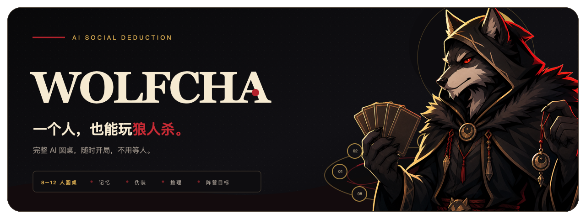

<p align="right"><a href="./README.md">English</a></p>



<p align="center">
  <strong>你坐一席，剩下的人交给 AI。</strong><br />
  随时开一桌有推理、有伪装、也有意外的狼人杀。
</p>

<p align="center">
  <a href="https://wolf-cha.com"><strong>在线开局</strong></a>
  ·
  <a href="#本地运行">本地运行</a>
  ·
  <a href="./README.md">English</a>
</p>

## 一个人，也能凑齐一桌

Wolfcha 保留了狼人杀最难替代、也最难约齐的部分：一整桌性格不同的玩家。你选择一个身份，加入 8–12 人对局；其余玩家的人设、秘密、发言和投票全部由 AI 驱动。

| 先有人设 | 记得桌面 | 为阵营行动 |
| --- | --- | --- |
| 每个 AI 都有稳定性格，再叠加一层隐藏的游戏身份。 | 他们会记住发言、投票、死亡结果和不断变化的怀疑链。 | 他们会根据阵营目标选择怀疑、保护、反驳、跟票或隐藏信息。 |

## 一局是怎么发生的

1. **黑夜行动**：狼人选择目标，神职根据各自掌握的信息行动。
2. **白天发言**：存活玩家解释、怀疑、误导，或者推动自己的判断。
3. **全员投票**：把语言博弈变成一次真正的桌面决策。
4. **局势重写**：死亡与新信息继续改变下一轮的关系。

可选身份包括 **村民、狼人、白狼王、预言家、女巫、猎人、守卫和白痴**。所有对话实时生成，即使配置相同，也可能打出完全不同的一桌。

## 为氛围服务的细节

- 复古视觉风格，以及昼夜切换时的眨眼转场。
- 角色发言时的口型动画。
- 神职夜间行动的专属立绘。
- 可选 AI 语音与观战模式。

## 项目由来

Wolfcha 诞生于 **观猹 × 魔搭环球黑客松**。名字由 **Wolf（狼人杀）** 和 **Cha（猹）** 组成：既在桌上参与推理，也像观众一样看一群 AI 人格互相碰撞。

## 本地运行

需要安装 Node.js 和 [pnpm](https://pnpm.io/)。

```bash
git clone https://github.com/oil-oil/wolfcha.git
cd wolfcha
pnpm install
cp .env.example .env.local
pnpm dev
```

打开 [http://localhost:3000](http://localhost:3000)。在 `.env.local` 中配置需要使用的服务，完整变量说明见 [`.env.example`](./.env.example)。

## 技术栈

[Next.js 16](https://nextjs.org/) · [TypeScript](https://www.typescriptlang.org/) · [Tailwind CSS 4](https://tailwindcss.com/) · [Jotai](https://jotai.org/) · [Radix UI](https://www.radix-ui.com/) · [Framer Motion](https://www.framer.com/motion/) · [Tiptap](https://tiptap.dev/)

## 感谢赞助


- [TokenDance](https://tokendance.space/) — 提供核心游戏流程、角色扮演和总结能力
- [百炼 DashScope](https://bailian.console.aliyun.com/) — 提供 AI 能力支持
- [观猹](https://watcha.cn/) — 提供 AI 能力与展示平台支持

## 后续计划

- 更好的移动端体验
- 结束后的复盘与自由聊天
- 更强的记忆、伪装和桌面行为
- 时间回溯、AI 洞察等特殊机制
- 和朋友一起加入 AI 圆桌
- 为表现出色的 AI 人格点赞

## License

[MIT](./LICENSE)
